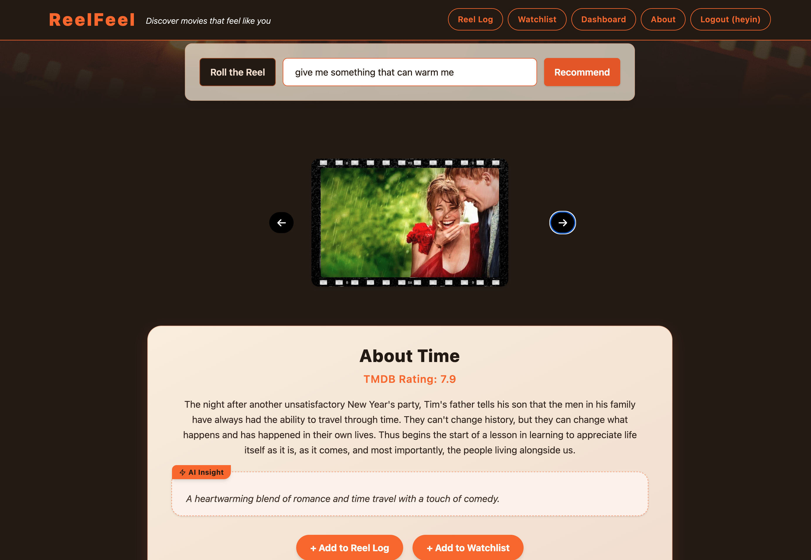
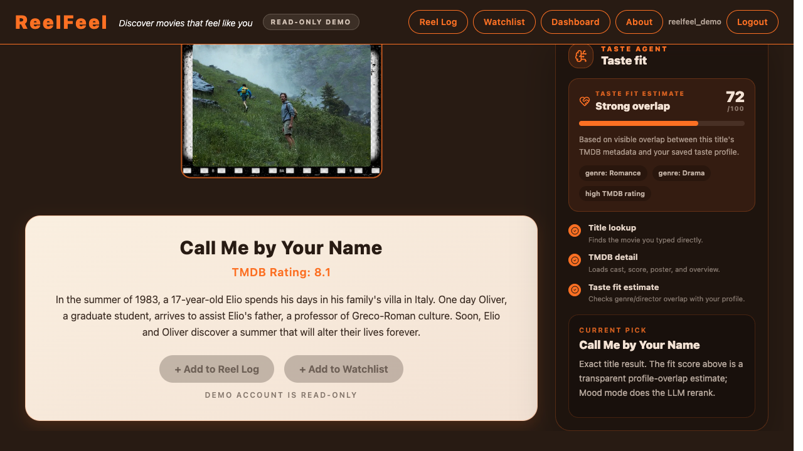
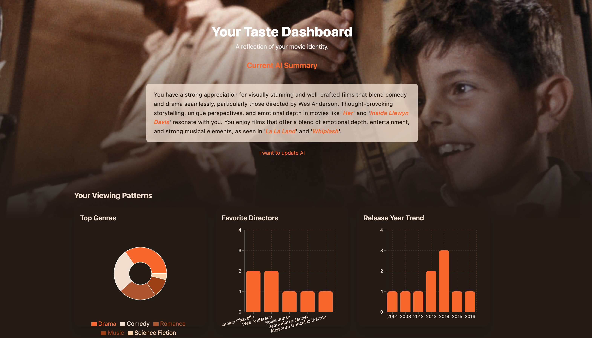

# ReelFeel: AI Taste Agent for Movie Discovery

ReelFeel is a portfolio-grade full-stack AI project that turns movie logs into a structured taste profile, retrieves TMDB candidates, and uses low-cost LLM reranking to explain why a film fits you.

It is designed to show:

- Hybrid TMDB retrieval + low-cost LLM reranking
- Structured taste memory from ratings, reviews, moods, and watch history
- JWT-scoped user data and a read-only live demo account
- AI usage logging with estimated token cost
- A product-facing Taste Agent Console that makes the recommendation logic visible

## Design Philosophy

I’ve always watched films not just for fun, but for connection — to something quiet, emotional, or hard to explain.  
Over time, I started logging what I watched, trying to understand why certain stories stayed with me. That reflection led to this project.

ReelFeel is built around the idea that recommendations should begin with the viewer.  
Instead of sorting by genre or popularity, it learns from how you react — what you rate, like, or write about.

I chose to use AI not just as a trend, but because I believe it's especially suited to understanding personal taste.  
The system acts like an AI agent: observing how you respond to films and gradually forming a sense of your preferences based on your history snapshots.

> In the end, ReelFeel is a small attempt to let AI assist in something very human: choosing a story that speaks to you.

## Features

### Live AI Taste Agent Demo

- Magic demo link support: `/demo?code=<DEMO_ACCESS_CODE>`
- Demo account is seeded with curated watched movies, reviews, snapshots, and a high-confidence taste profile
- Demo account is read-only, so visitors can explore without damaging the showcase data
- Taste Agent Console shows profile confidence, memory count, AI cost, match tags, and recommendation reasoning

### Personalized AI Recommendation

- Uses GPT + TMDB API to recommend movies based on user's taste profile
- Avoids suggesting movies already in the user's history (watched/waiting lists)

### Taste Modeling

- Every time a user likes, rates, or reviews a movie, a “taste snapshot” is created
- Snapshots are summarized into a long-term taste profile using GPT
- These profiles drive future recommendations and provide transparent reasoning for each suggestion.

### Interactive Movie Management

- Can log movies to watched list with detailed user input: rating (1–10), moods, comments, likes
- Waiting list (to-watch), with backend validation to avoid duplicates
- Review interface supports seamless transition from waiting → watched

### Authentication & Security

- Login and registration system using FastAPI + JWT and bcrypt hashing

### API-first Backend Design

- Modular API endpoints for all operations: recommendation, snapshot, taste summary, list CRUD
- Built with asynchronous FastAPI and SQLite, enabling smooth multi-user interaction

---

## Key Screenshots

### Main Page


### AI Mood-Based Recommendation and Real-Time Movie Search




### AI-Powered Taste Dashboard



### Your Reel Collection


---

## Tech Stack

| Layer     | Technology                                                        |
| --------- | ----------------------------------------------------------------- |
| Frontend  | React (Vite), TailwindCSS, Framer Motion (animations)             |
| Backend   | FastAPI, SQLite, Async SQLAlchemy, Pydantic                       |
| Auth      | JWT (token-based auth), bcrypt (password hashing)                 |
| AI Logic  | OpenAI(recommendation, taste modeling), TMDB API (movie data)     |
| UI Design | Retro film-inspired theme, responsive layout, animated components |

## Getting Started

### Backend (FastAPI)

1. _(Optional)_ Create and activate a virtual environment:

   ```bash
   python3 -m venv venv_reelfeel
   source venv_reelfeel/bin/activate  # macOS/Linux
   ```

2. Install dependencies:

   ```bash
   cd backend
   pip install -r requirements.txt
   ```

3. Create a local env file and fill in your keys:

   ```bash
   cp .env.example .env
   openssl rand -hex 32  # use this for MOVIE_PASS_KEY
   ```

4. Start the development server:

   ```bash
   uvicorn main:app --reload
   ```

### Frontend (React)

To start the frontend dev server:

```bash
cd frontend
npm install
npm run dev
```

## Environment Variables

The backend loads `backend/.env` directly. Start from `backend/.env.example`:

```env
DATABASE_URL=sqlite+aiosqlite:///./app.db
OPENAI_API_KEY=your_openai_key
TMDB_API_KEY=your_tmdb_key
MOVIE_PASS_KEY=your_jwt_secret_key
DEMO_ENABLED=true
DEMO_USERNAME=reelfeel_demo
DEMO_ACCESS_CODE=your_demo_magic_link_code
OPENAI_MODEL_CHEAP=gpt-4.1-nano
OPENAI_MODEL_STANDARD=gpt-4.1-mini
```

The app uses the cheap model for small taste snapshots and the standard model for recommendation ranking and taste summaries.
Guest recommendations use TMDB first to avoid unnecessary LLM calls. Logged-in recommendations use the user's taste profile, TMDB candidate retrieval, and a low-cost LLM rerank step.

AI usage logging is enabled by default and can be inspected with:

```bash
curl http://localhost:8000/ai-usage-summary \
  -H "Authorization: Bearer <token>"
```

The cost values are estimates based on the model prices configured in `.env.example`.

Frontend env starts from `frontend/.env.example`:

```env
VITE_BACKEND_URL=http://localhost:8000
VITE_DEMO_ACCESS_CODE=your_demo_magic_link_code
```

## Demo Walkthrough

1. Open `/demo?code=<DEMO_ACCESS_CODE>` to enter the read-only showcase account.
2. Scan the Taste Agent Console on the homepage to see the seeded taste memory.
3. Ask for a mood, for example `quiet emotional family drama`.
4. Inspect the carousel: the center card is the main recommendation, and the console explains the match.
5. Visit Dashboard to see the structured taste profile, preference axes, snapshots, and charts.
6. Try adding or editing a movie to see the read-only demo protection.

## Architecture Flow

```text
Review / Rating / Mood
        ↓
Taste Snapshot
        ↓
Structured Taste Profile
        ↓
TMDB Candidate Pool
        ↓
Low-Cost LLM Rerank
        ↓
Explainable Recommendation + AI Usage Logging
```

## What This Demonstrates

- Full-stack product architecture with React, FastAPI, SQLAlchemy, and JWT auth
- AI system design that controls cost through model routing and bounded prompts
- Secure user-data boundaries: recommendations and taste data are scoped to the JWT user
- Product polish: demo mode, protected routes, read-only showcase data, and visible AI reasoning
- Testing mindset: backend foundation tests, frontend lint/build checks, and manual smoke flows

## Project Structure

```
/backend
  ├── routers/              # API route groups
  ├── services/             # OpenAI, TMDB, taste, recommendation logic
  ├── repositories/         # Database query helpers
  ├── schemas.py            # Pydantic API contracts
  ├── ai.py                 # Backward-compatible AI wrapper
  ├── auth.py               # JWT login/register logic
  ├── database.py           # Async SQLite setup
  ├── models.py             # SQLAlchemy ORM models
  ├── main.py               # FastAPI app assembly
  └── app.db                # Local SQLite database

/frontend
  ├── assets/               # Static assets
  ├── components/           # Reusable UI elements
  ├── hooks/                # Custom React hooks
  └── pages/                # Route-level views (Main, Dashboard, etc.)
```

## Status

ReelFeel is being refactored into a low-cost AI Taste Agent foundation. The current focus is reliable local development, JWT-scoped user data, structured taste profiles, TMDB-backed recommendation candidates, and transparent AI usage/cost tracking.

**Plans:**

- Exclude movies already in the waiting list from AI recommendations
- Improve title matching accuracy to avoid wrong movie retrievals from TMDB
- Add subtle UI animations and polish
- Expand the Dashboard with more insights and interactive feedback
- Support for demo user access before final deployment
- transfer SQLlite to postgreSQL for deployment reason
